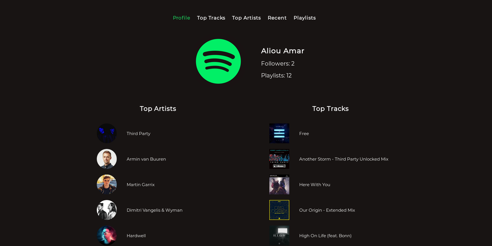
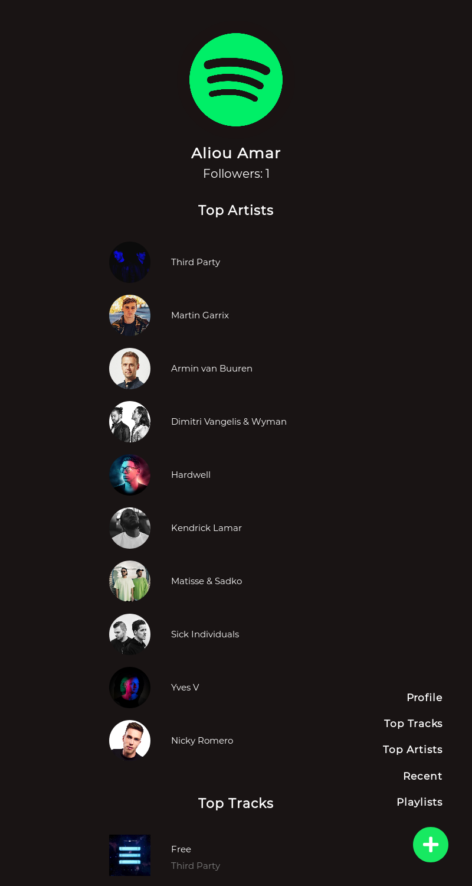
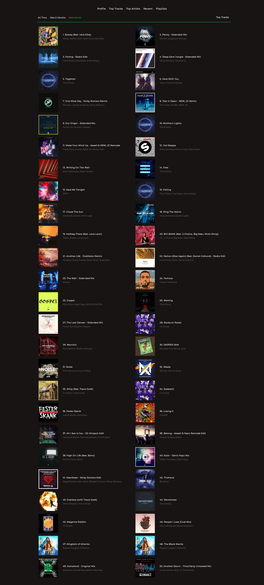
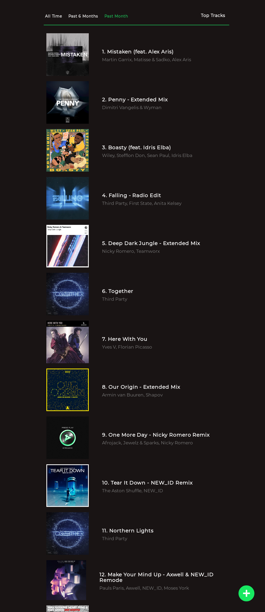

# Spotistats

## To Do

- [ ] Modify how the token data is saved in the CookieStore
- [ ] Find a way to refresh the token when expired
- [ ] Make Login page responsive
- [ ] Make an animation of the navbar on mobile (the plus button)
- [ ] Find a better way to animate the tracks/artists on loading
- [ ] Add loading/progress bar
- [ ] Finish the playlists, track, album and artists pages
- [ ] Make more screenshots
- [ ] Add durations and/or albums to track divs
- [ ] Deploy on Heroku

## Screenshots

- Homepage

- Top Tracks page

